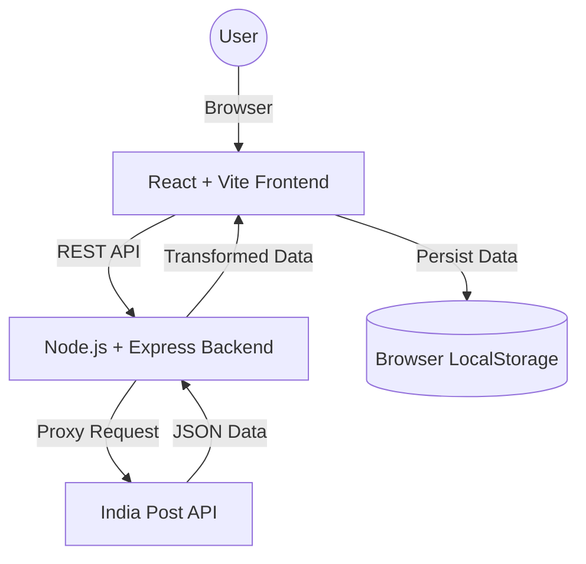
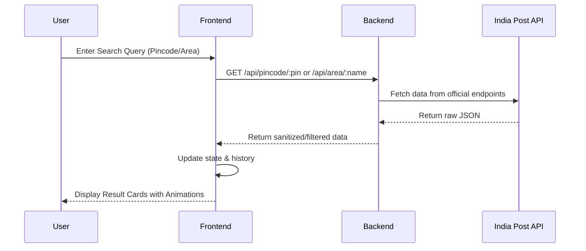

# 📍 Bangalore Pincode Explorer

A professional, full-stack web application designed to help users explore and navigate the complex postal network of Bangalore (Bengaluru), India. This production-ready solution provides instant access to area details and pincodes with a premium user experience.

---

## 📖 Project Overview
Bangalore Pincode Explorer is a high-performance utility application that bridges the gap between residents and postal information. It leverages the official India Post API via a secure backend proxy to provide real-time, accurate data. The application features a modern, responsive UI with advanced state management and persistent user preferences.

## ❓ Problem Statement
Finding accurate pincodes or area details for specific localities in a rapidly growing city like Bangalore can be challenging. Users often face:
- Fragmented data sources.
- Non-responsive legacy government portals.
- Lack of easy-to-use mobile interfaces for quick lookups.

## 💼 Business Requirements
- Provide a unified interface for bi-directional search (Area ↔ Pincode).
- Ensure data privacy and security by abstracting external API calls through a backend proxy.
- Deliver a premium, fast, and accessible user experience to build brand trust.
- Support offline persistence for frequent searches to reduce API dependency.

## ⚙️ Functional Requirements
- **Pincode Search**: Retrieve detailed office names, delivery status, and district info using a 6-digit code.
- **Area Search**: Match locality names to their corresponding pincodes.
- **Search History**: Store and display the last 5 searches using LocalStorage.
- **Bookmarks**: Allow users to "favorite" locations for one-click access.
- **Theme Support**: Dynamic Light/Dark mode switching.
- **Clipboard Integration**: Instant copying of pincodes to the system clipboard.

## 🛠️ Non-Functional Requirements
- **Scalability**: Decoupled frontend and backend for independent scaling.
- **Responsive Design**: Optimized for everything from small smartphones to large 4K displays.
- **Performance**: Sub-500ms response times for internal API calls; use of Skeleton loaders for external latency.
- **Availability**: Deployed on robust cloud infrastructure (Vercel/Render).

---

## 🏗️ System Architecture



### Application Workflow



---

## 📂 Folder Structure

```text
bangalore-pincode-explorer/
├── client/                 # Frontend Layer
│   ├── src/
│   │   ├── components/     # Atomic UI components
│   │   ├── services/       # Axios API configurations
│   │   ├── hooks/          # Custom search & storage hooks
│   │   └── App.jsx         # App Root & State Manager
│   └── vite.config.js      # Build & Plugin settings
└── server/                 # Backend Layer
    ├── routes/             # API Route Definitions
    ├── controllers/        # Business Logic Handlers
    ├── services/           # India Post Service Layer
    └── index.js            # Express Entry Point
```

---

## 🚀 Technology Stack

### Frontend
- **React.js & Vite**: Modern framework for reactive UI and lightning-fast development.
- **Tailwind CSS v4**: Utility-first styling with native Vite integration.
- **Framer Motion**: Smooth, cinematic transitions and entry animations.
- **React Icons**: Industry-standard iconography.

### Backend
- **Node.js & Express**: Scalable and lightweight server environment.
- **Axios**: Handling asynchronous HTTP requests.
- **CORS & Dotenv**: Secure cross-origin resource sharing and environment management.

---

## 🌟 Features List
- [x] **Dual Search Mode**: Switch between Pincode and Area Name instantly.
- [x] **Premium Dark Mode**: System-aware theme with manual override.
- [x] **Skeleton Loaders**: High-quality placeholders during data fetching.
- [x] **Search History**: Persistent local storage for recent lookups.
- [x] **Favorites/Bookmarks**: Save frequent locations for quick reference.
- [x] **Copy to Clipboard**: Quick-action buttons for all postal codes.
- [x] **Mobile Optimization**: Designed specifically for the "on-the-go" user.

---

## 💻 Local Setup Instructions

### Prerequisites
- Node.js (v18+)
- npm

### 1. Clone & Install
```bash
git clone https://github.com/neeteshdixit/Bangalore-pincode-explorer.git
cd Bangalore-pincode-explorer
```

### 2. Configure Backend
```bash
cd server
npm install
npm run dev
```
*Note: Create a `.env` file with `PORT=5000`.*

### 3. Configure Frontend
```bash
cd ../client
npm install
npm run dev
```
*The application will be available at `http://localhost:5173`.*

---

## 🌐 API Request Flow
1. **Frontend Request**: User types "Indiranagar". Frontend calls `GET /api/area/Indiranagar`.
2. **Backend Proxy**: Express catches the request, validates the length, and forwards to `api.postalpincode.in`.
3. **Data Transformation**: Backend receives the external data, checks for "Error" status, and returns a clean object to the frontend.
4. **UI Update**: Frontend updates the result state, triggering a Framer Motion animation for the new cards.

---

## ☁️ Deployment Guide

### Backend (Render)
1. Link GitHub repo to Render.
2. Select `server` as the root directory.
3. Build command: `npm install`.
4. Start command: `node index.js`.

### Frontend (Vercel)
1. Link GitHub repo to Vercel.
2. Select `client` as the root directory.
3. Vercel automatically detects Vite and builds the project.
4. Ensure `VITE_API_URL` environment variable points to your Render backend.

---

## 🧠 Challenges & Learnings
- **Challenge**: Handling Tailwind CSS v4's new architecture and Vite plugin transition.
- **Solution**: Moved from legacy PostCSS config to the modern `@tailwindcss/vite` plugin for better performance.
- **Learning**: Implementing a backend proxy significantly improved the frontend's security and reduced CORS issues encountered with direct API calls.

---

## 👤 Author
**Neetesh Dixit**
- [GitHub](https://github.com/neeteshdixit)
- [LinkedIn](https://linkedin.com/in/neeteshdixit)

---

## 📄 License
MIT License.
